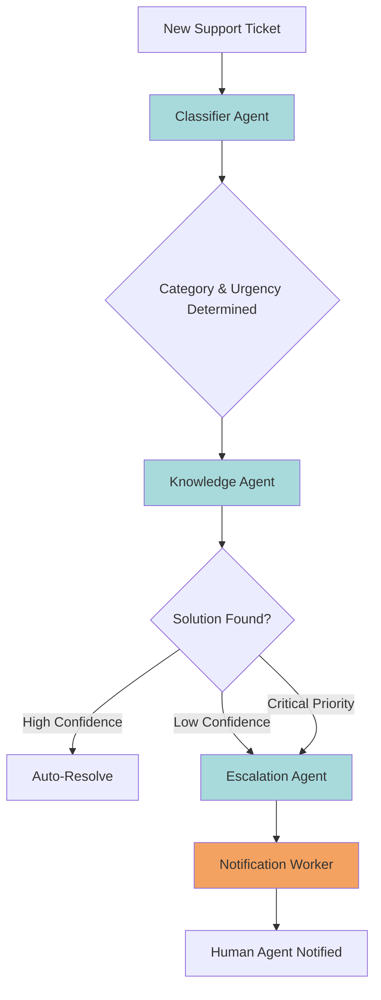
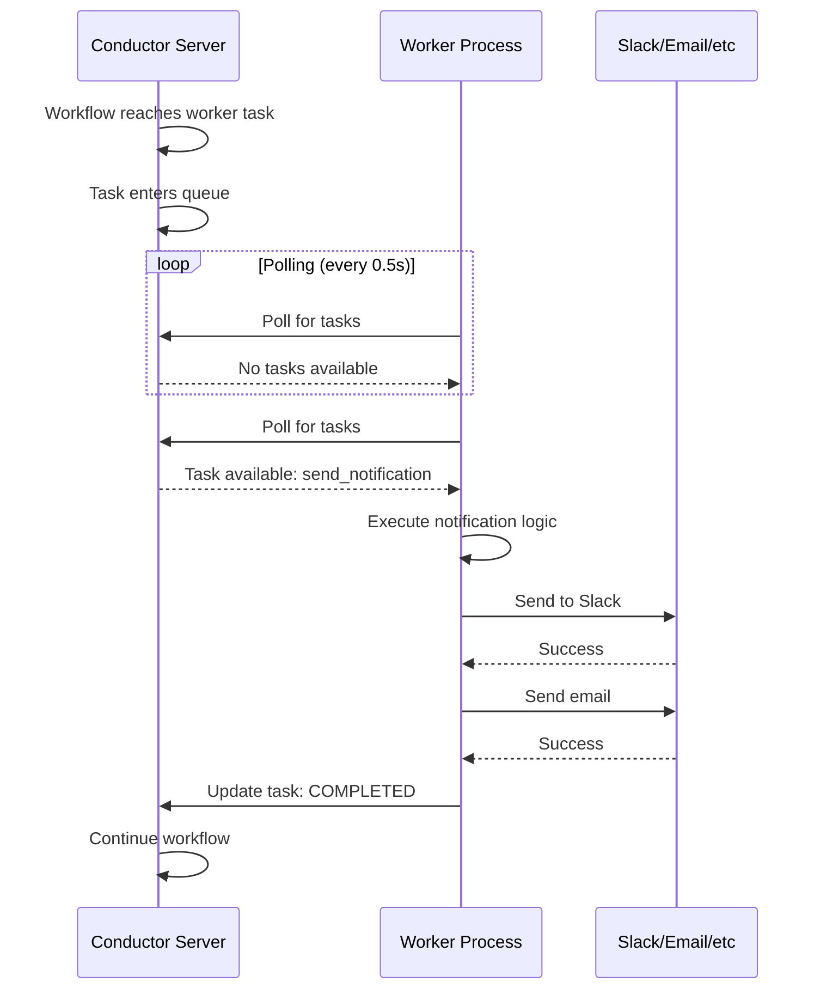

# Building Multi-Agent AI Systems: From Chaos to Coordination with Orkes Conductor

If you've built a single AI agent, you already know the magic: give an LLM a task, and watch it reason through a solution. But here's where it gets interesting: what happens when you need multiple AI agents working together, each with specialized knowledge, coordinating to solve complex problems? Welcome to the world of multi-agent systems.

Today, I'll walk you through building an AI-powered customer support triage system using Orkes Conductor. We'll orchestrate three specialized agents that work together to classify tickets, search for solutions, and escalate when needed. More importantly, you'll see how Conductor acts as the "air traffic controller" that keeps everything running smoothly.

## The Problem: Support Tickets Don't Fit One-Size-Fits-All

Think about your typical customer support workflow. Tickets flood in with wildly different needs: billing questions, critical outages, account issues, feature requests. A single AI agent trying to handle everything becomes a jack-of-all-trades and master of none.

What if instead, you could build a team of specialist agents? One that's excellent at classification, another that knows your documentation inside-out, and a third that makes smart escalation decisions. That's exactly what we're building.

## The Multi-Agent Architecture

Our system uses three specialized agents orchestrated by Orkes Conductor:



### Agent Responsibilities

**Classifier Agent**: The first responder. It reads the ticket and extracts structured information - what category does this fall into? How urgent is it? What's the customer's sentiment? This agent transforms unstructured text into actionable metadata.

**Knowledge Agent**: Your documentation expert. Armed with the classification, it searches internal knowledge bases, FAQs, and past resolutions. It doesn't just find relevant articles; it synthesizes a suggested response and provides a confidence score.

**Escalation Agent**: The decision maker. It evaluates the knowledge agent's confidence against the ticket's urgency and decides whether to auto-resolve or route to a human. Critical issues? Straight to the on-call team. High-confidence solutions? Automatic response.

## Implementation: Building the Classifier Agent

Let's start with code. Here's how we define the Classifier Agent using Orkes Conductor's Python SDK:

```python
from conductor.client.workflow.task.llm_tasks.llm_chat_complete import LlmChatComplete, ChatMessage

def create_classifier_agent():
    return LlmChatComplete(
        task_ref_name="classify_ticket",
        llm_provider="openai",  # Match this to your Orkes integration name
        model="gpt-4",
        messages=[
            ChatMessage(
                role="system",
                message="You are a customer support ticket classifier. Analyze tickets and provide category (billing/technical/account/general), sentiment (positive/neutral/negative/angry), and urgency (low/medium/high/critical) in JSON format with a reasoning field."
            ),
            ChatMessage(
                role="user",
                message="${workflow.input.ticket_content}"
            )
        ]
    )
```

Notice how we're using Conductor's `LlmChatComplete` task? This is where orchestration shines. Instead of writing custom code to call OpenAI's API, handle retries, and manage state, Conductor handles all of that. You just define what the agent should do.

The messages use `ChatMessage` objects with familiar role-based structure (system and user), just like you'd use with OpenAI's API directly. The `${workflow.input.ticket_content}` syntax is Conductor's way of passing data between tasks - it creates a data pipeline where each agent's output becomes the next agent's input.

## The Knowledge Agent: Context is Everything

The Knowledge Agent builds on what the Classifier learned:

```python
def create_knowledge_agent():
    return LlmChatComplete(
        task_ref_name="search_knowledge",
        llm_provider="openai",  # Match this to your Orkes integration name
        model="gpt-4",
        messages=[
            ChatMessage(
                role="system",
                message="You are a knowledge base expert. Provide KB articles, resolution steps, confidence level (0-100), and a suggested customer response in JSON format."
            ),
            ChatMessage(
                role="user",
                message="Ticket: ${workflow.input.ticket_content}. Category: ${classify_ticket.output.result.category}. Urgency: ${classify_ticket.output.result.urgency}"
            )
        ]
    )
```

See how it references `${classify_ticket.output.result.category}` in the user message? That's data from our first agent flowing into the second. This is multi-agent coordination in action: each agent builds on the previous one's work.

## Worker Tasks: Bridging Conductor and Your Infrastructure

Here's where things get practical. LLM tasks are great, but real-world systems need to integrate with existing infrastructure - Slack, email, ticketing systems, databases. That's what worker tasks do.

A worker task is a piece of code that runs outside Conductor but is orchestrated by it. Think of it as your custom business logic that Conductor schedules and monitors. Here's our notification worker:

```python
from conductor.client.worker.worker_task import WorkerTask

@WorkerTask(task_definition_name='send_escalation_notification',
            domain='support',
            poll_interval=0.5)
def send_notification(task_input):
    """
    Custom worker that sends notifications when tickets are escalated.
    This polls Conductor for tasks and executes them.
    """
    ticket_id = task_input.get('ticket_id')
    urgency = task_input.get('urgency')
    assigned_to = task_input.get('assigned_to', 'support-team')

    # Determine notification channels based on urgency
    if urgency in ['critical', 'high']:
        channels = ['slack', 'email', 'pagerduty']
    else:
        channels = ['email']

    # Send notifications (implementation details omitted)
    # In production: call Slack API, SendGrid, PagerDuty, etc.

    return {
        'notification_sent': True,
        'channels': channels,
        'timestamp': datetime.utcnow().isoformat()
    }
```

### How Worker Tasks Actually Work

Here's the workflow visualization showing how workers integrate:



The worker uses a polling mechanism - it continuously asks Conductor "do you have any tasks for me?" When Conductor schedules the `send_escalation_notification` task, the worker picks it up, executes it, and reports back the results.

This architecture is powerful because:

1. **Decoupling**: Your worker can live anywhere - different server, different language, different cloud provider
2. **Scalability**: Spin up more workers when load increases
3. **Reliability**: If a worker fails, Conductor can retry or route to another worker
4. **Observability**: Every task execution is tracked and visible in Conductor's UI

## Composing the Complete Workflow

Now we wire everything together:

```python
from conductor.client.workflow.conductor_workflow import ConductorWorkflow

def create_support_triage_workflow():
    workflow = ConductorWorkflow(
        name="customer_support_triage",
        version=1,
        executor=workflow_executor
    )

    # Define all agents and tasks
    classifier = create_classifier_agent()
    knowledge = create_knowledge_agent()
    escalation_eval = SimpleTask(
        task_def_name="evaluate_escalation",
        task_reference_name="eval_escalation"
    )
    notification = SimpleTask(
        task_def_name="send_escalation_notification",
        task_reference_name="notify_team"
    )

    # Build the execution flow
    workflow >> classifier >> knowledge >> escalation_eval >> notification

    return workflow
```

That `>>` operator is doing heavy lifting. It's creating a directed acyclic graph (DAG) that represents your workflow. Conductor takes this definition and manages execution: running tasks in order, passing data between them, handling failures, and providing visibility into every step.

## Why This Matters

When you build a multi-agent system this way, you get benefits that are hard to achieve otherwise:

**Separation of Concerns**: Each agent does one thing well. Need to improve classification? Update that agent without touching knowledge search or escalation logic.

**Testability**: Each agent can be tested independently before deployment.

**Scalability**: Scale each component based on load. The Knowledge Agent might need more compute than the Classifier - with Conductor, you can scale them independently.

**Observability**: Every workflow execution is tracked. When something breaks, you know exactly which agent failed and why.

**Flexibility**: Adding new agents is simple - just update the workflow definition without changing existing agent code.

## The Real Power: Iteration

This architecture enables rapid iteration. Start simple, run in production, then refine. Add duplicate detection, human-in-the-loop approval, or A/B test different prompts - all through workflow changes, not agent rewrites.

## Getting Started

Want to build this yourself? Head to [orkes.io](https://orkes.io/) and sign up for a free developer account. The Jupyter notebook with the complete implementation is available in this repository - clone it, add your API keys, and start experimenting.

Multi-agent systems aren't just the future of AI applications; they're how we'll build more reliable, maintainable, and powerful systems today. And with orchestration platforms like Orkes Conductor, that future is surprisingly accessible.

Now go build something amazing. Your customer support team will thank you.
