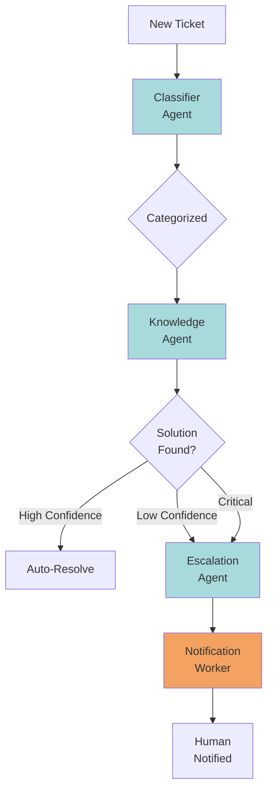
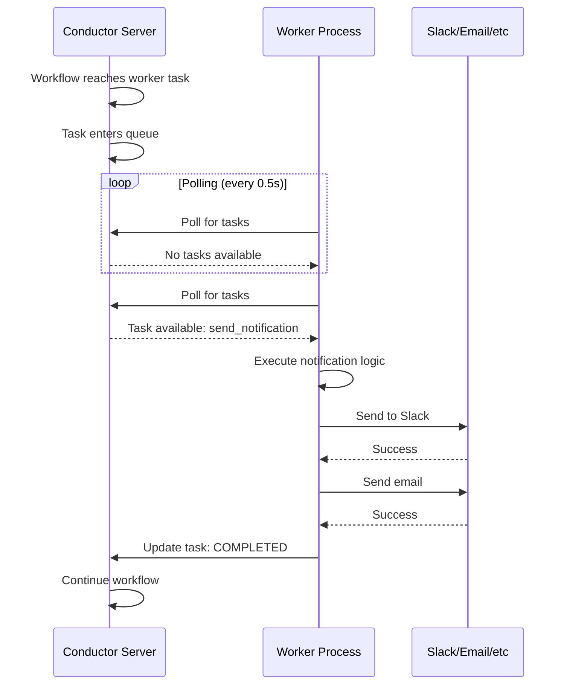

# Orchestrating AI Agents: From Solo Acts to Symphony

When you ask an AI to write code, summarize a document, or answer a question, you're working with a single agent—one model handling the entire task. It's like having one musician play all the instruments in a song. Sure, it works, but you're missing something.

What if instead, you had specialists? A drummer keeping rhythm, a bassist laying the foundation, a guitarist adding melody, and a conductor ensuring everyone plays in harmony. That's the power of multi-agent AI systems, and today I'll show you how to build one using Orkes Conductor.

We're going to build an AI-powered customer support triage system where three specialized agents collaborate to handle incoming tickets automatically. More importantly, you'll see how orchestration platforms like Conductor solve the hard problems that emerge when AI agents need to work together.

## The Problem: One Agent Can't Do Everything Well

Think about your typical support queue. Tickets flood in with wildly different needs:
- "I can't log into my account"
- "URGENT: Production is down!"
- "Why was I charged twice?"
- "How do I reset my password?"

You could throw all of these at a single LLM and ask it to handle everything. But here's what happens: the model becomes a generalist that's decent at classification, okay at finding solutions, mediocre at escalation decisions. It's trying to be everything, so it masters nothing.

Instead, what if you built a team of specialists? That's where multi-agent systems shine.

## The Multi-Agent Architecture

Our system uses three AI agents, each with a defined role:



### Meet the Team

**Classifier Agent**: The intake specialist. It reads every ticket and extracts structured data—category, sentiment, urgency. Think of it as your emergency room triage nurse, determining what needs immediate attention versus what can wait.

**Knowledge Agent**: Your documentation expert. Armed with the classification, it searches your knowledge base, past tickets, and FAQs. It doesn't just find relevant articles—it synthesizes a suggested response and provides a confidence score.

**Escalation Agent**: The decision maker. It evaluates the knowledge agent's confidence against the ticket's urgency. Critical issues go straight to the on-call team. High-confidence solutions? Sent automatically.

But here's the challenge: how do these agents communicate? How do you handle failures? What if the Knowledge Agent times out? Who orchestrates the handoffs?

That's where Conductor comes in.

## Why Orchestration Matters

When you move from one agent to many, complexity explodes. You need:
- **Data flow**: How does the Classifier's output become the Knowledge Agent's input?
- **Error handling**: What happens when an API call fails?
- **State management**: How do you track a ticket across multiple async operations?
- **Observability**: When something breaks, how do you debug it?

Conductor handles all of this. It's the air traffic controller for your AI agents.

## Building the Classifier Agent

Let's start with code. Here's how you define the Classifier Agent using Conductor's Python SDK:

```python
from conductor.client.workflow.task.llm_tasks.llm_chat_complete import LlmChatComplete, ChatMessage

def create_classifier_agent():
    return LlmChatComplete(
        task_ref_name="classify_ticket",
        llm_provider="openai",  # Match this to your Orkes integration name
        model="gpt-4",
        messages=[
            ChatMessage(
                role="system",
                message="You are a customer support ticket classifier. Analyze tickets and provide category (billing/technical/account/general), sentiment (positive/neutral/negative/angry), and urgency (low/medium/high/critical) in JSON format with a reasoning field."
            ),
            ChatMessage(
                role="user",
                message="${workflow.input.ticket_content}"
            )
        ]
    )
```

Notice a few things:

**1. No API calls in your code**: You're not calling OpenAI's API directly. Conductor handles the HTTP request, retries, timeout logic, and error handling.

**2. Variable substitution**: The `${workflow.input.ticket_content}` syntax is Conductor's way of passing data. When the workflow executes, this gets replaced with the actual ticket text.

**3. Structured messages**: The ChatMessage objects use the familiar system/user role pattern you'd use with any LLM API.

This is where orchestration shines—you define *what* should happen, not *how* to manage API calls, state, and failures.

## The Knowledge Agent: Building on What Came Before

The Knowledge Agent is where multi-agent coordination really pays off:

```python
def create_knowledge_agent():
    return LlmChatComplete(
        task_ref_name="search_knowledge",
        llm_provider="openai",
        model="gpt-4",
        messages=[
            ChatMessage(
                role="system",
                message="You are a knowledge base expert. Provide KB articles, resolution steps, confidence level (0-100), and a suggested customer response in JSON format."
            ),
            ChatMessage(
                role="user",
                message="Ticket: ${workflow.input.ticket_content}. Category: ${classify_ticket.output.result.category}. Urgency: ${classify_ticket.output.result.urgency}"
            )
        ]
    )
```

See that `${classify_ticket.output.result.category}`? That's data from the first agent flowing into the second. The Knowledge Agent *builds on* the Classifier's work.

This is multi-agent coordination in action. Each agent:
- Has a single, well-defined job
- Builds on the previous agent's output
- Produces structured data for the next step

The workflow becomes a pipeline where intelligence accumulates.

## Worker Tasks: When AI Agents Need to Do Real Work

Here's where things get practical. LLM agents are great for reasoning, classification, and generation. But real-world systems need to *act*—send a Slack message, create a ticket in Jira, trigger a PagerDuty alert.

That's what worker tasks do. They're pieces of code that run outside Conductor but are orchestrated by it.

```python
from conductor.client.worker.worker_task import WorkerTask

@WorkerTask(task_definition_name='send_escalation_notification',
            domain='support',
            poll_interval=0.5)
def send_notification(task_input):
    """
    Custom worker that sends notifications when tickets are escalated.
    This polls Conductor for tasks and executes them.
    """
    ticket_id = task_input.get('ticket_id')
    urgency = task_input.get('urgency')
    assigned_to = task_input.get('assigned_to', 'support-team')

    # Determine notification channels based on urgency
    if urgency in ['critical', 'high']:
        channels = ['slack', 'email', 'pagerduty']
    else:
        channels = ['email']

    # In production: call Slack API, SendGrid, PagerDuty, etc.
    send_to_slack(ticket_id, assigned_to)
    send_email(ticket_id, urgency)

    return {
        'notification_sent': True,
        'channels': channels,
        'timestamp': datetime.utcnow().isoformat()
    }
```

### How Worker Polling Works

Here's the key insight: workers actively *pull* tasks from Conductor rather than having tasks pushed to them. Here's the flow:



This polling architecture gives you:

**Decoupling**: Your worker can live anywhere—different server, different language, different cloud provider. It just needs network access to Conductor.

**Scalability**: Need to handle more load? Spin up more worker instances. They all poll the same queue.

**Reliability**: If a worker crashes mid-task, Conductor knows the task didn't complete. It can retry or route to another worker.

**Observability**: Every task execution is tracked in Conductor's UI. When something breaks, you see exactly which task failed and why.

## Composing the Complete Workflow

Now we wire everything together:

```python
from conductor.client.workflow.conductor_workflow import ConductorWorkflow

def create_support_triage_workflow():
    workflow = ConductorWorkflow(
        name="customer_support_triage",
        version=1,
        executor=workflow_executor
    )

    # Define all agents and tasks
    classifier = create_classifier_agent()
    knowledge = create_knowledge_agent()
    escalation = create_escalation_agent()
    notification = create_notification_task()

    # Build the execution flow
    workflow >> classifier >> knowledge >> escalation >> notification

    return workflow
```

That `>>` operator is doing a lot of heavy lifting. It's creating a directed acyclic graph (DAG) that represents your workflow. Conductor takes this definition and manages:
- Running tasks in order
- Passing data between them
- Handling failures with retries
- Providing visibility into every step

## The Real Power: What You Get For Free

When you build a multi-agent system this way, you get capabilities that are hard to achieve otherwise:

**Separation of Concerns**: Each agent does one thing well. Need to improve classification? Update that agent without touching knowledge search or escalation logic. Deploy the new Classifier, and your workflow automatically uses it.

**Independent Scaling**: Maybe your Knowledge Agent is compute-intensive and needs GPUs. The Classifier is fast and runs on CPUs. With Conductor, you scale each component based on its needs.

**Testability**: Test each agent independently before integration. Mock the Classifier's output to test the Knowledge Agent in isolation. This is impossible when everything's in one monolithic prompt.

**Observability**: Every workflow execution is tracked. When a ticket gets misclassified, you see exactly what the Classifier returned and why the Knowledge Agent couldn't find a solution. No more black boxes.

**Flexibility**: Want to add duplicate detection? Human-in-the-loop approval? A/B test different prompts? These are workflow changes, not agent rewrites.

## Benefits and Challenges

### What You Gain
- **Better results**: Specialized agents outperform generalists
- **Easier maintenance**: Change one agent without risking others
- **Clear ownership**: Each agent has defined inputs/outputs
- **Production-ready patterns**: Built-in retry, timeout, error handling

### What It Costs You
- **More moving parts**: Three agents means three things to monitor
- **Network overhead**: Agents communicate via Conductor, not memory
- **Learning curve**: You're adopting an orchestration platform, not just an SDK

In my experience, the benefits far outweigh the costs once you move past proof-of-concept. The first time you need to debug why a ticket was misrouted, you'll appreciate having visibility into every step.

## Getting Started

If you want to build this yourself, head to [orkes.io](https://orkes.io/) and sign up for a free developer account. The Jupyter notebook with the complete implementation is available in this repository—clone it, add your API keys, and start experimenting.

The future of AI applications isn't bigger models. It's better orchestration. Multi-agent systems let you combine specialized models, traditional code, and external integrations into workflows that are more reliable, maintainable, and powerful than any single agent could be.

Start simple. Add agents as you need them. And most importantly, enjoy building systems where AI agents work together like a well-rehearsed team.
